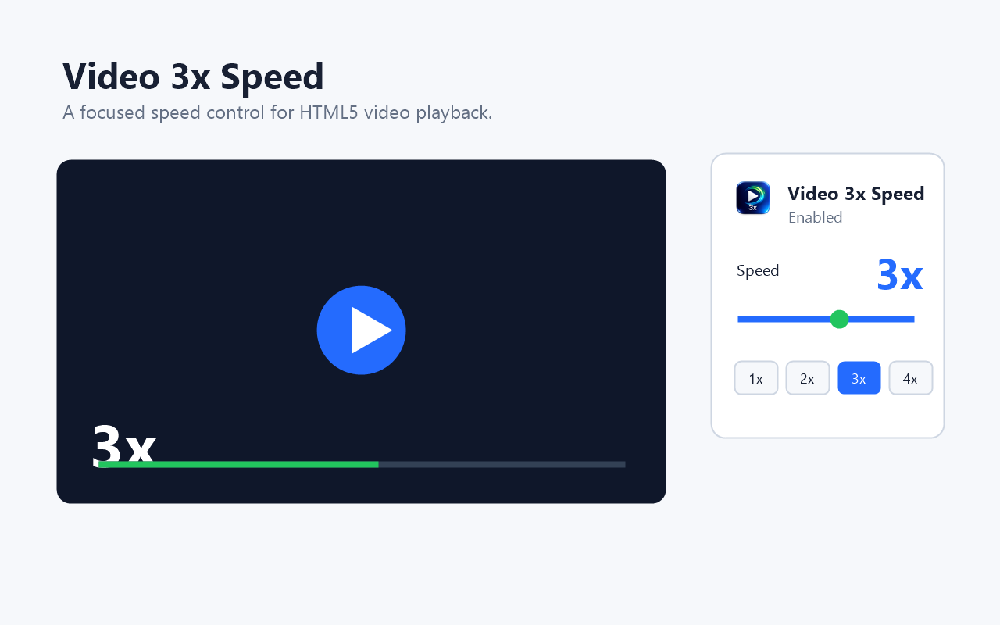
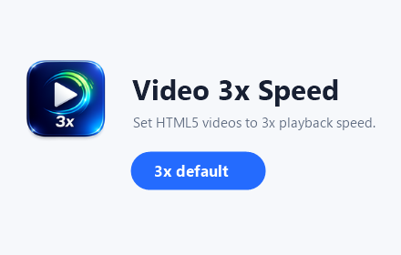

<p align="center">
  
</p>

<h1 align="center">Video 3x Speed</h1>

<p align="center">
  A polished Manifest V3 Chrome extension for keeping HTML5 videos at your preferred high-speed playback rate.
</p>

<p align="center">
  
  
  
</p>

<p align="center">
  
</p>

## Overview

Video 3x Speed gives every standard HTML5 video a focused speed control layer. It defaults to `3x`, keeps the chosen speed when pages try to reset playback rate, and includes a compact toolbar popup for quick adjustments.

The extension is intentionally small: no analytics, no remote code, no account system, and no background service doing extra work.

## Highlights

| Capability | Detail |
| --- | --- |
| Fast by default | New videos are set to `3x` automatically. |
| Persistent control | If a page resets playback speed, the extension applies your selected speed again. |
| Toolbar popup | Pause the extension or switch between preset speeds in one click. |
| Fine adjustment | Use the slider to choose any speed from `0.25x` to `5x`. |
| Privacy-first | Stores only the enable state and selected speed through Chrome storage. |

## Interface

<p align="center">
  
</p>

The popup is designed to stay quiet and task-focused: one switch, one speed value, one slider, and four common presets.

## Icon Set

| 16px | 32px | 48px | 128px |
| --- | --- | --- | --- |
|  |  |  |  |

## Local Installation

1. Open `chrome://extensions/`.
2. Enable `Developer mode`.
3. Choose `Load unpacked`.
4. Select this project folder.

Select the root folder of this repository.

## Chrome Web Store Package

Build the upload package:

```powershell
powershell -ExecutionPolicy Bypass -File scripts/build.ps1
```

The Chrome Web Store upload file is created at:

```text
dist/video-3x-speed-chrome-web-store.zip
```

## Project Structure

```text
video-3x-speed/
|-- manifest.json
|-- content.js
|-- popup.html
|-- popup.css
|-- popup.js
|-- images/
|-- store-assets/
|-- scripts/
|-- PRIVACY.md
`-- STORE_LISTING.md
```

## Privacy

Video 3x Speed does not collect, transmit, sell, or share user data. It only stores:

- whether the extension is enabled
- the selected playback speed

See [PRIVACY.md](PRIVACY.md) for the full privacy statement.

## Status

This repository contains the source code, listing copy, visual assets, and a store-ready ZIP build workflow for the Chrome Web Store submission process.
